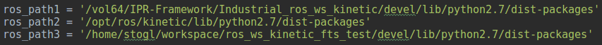
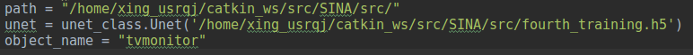
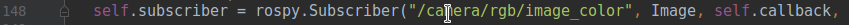
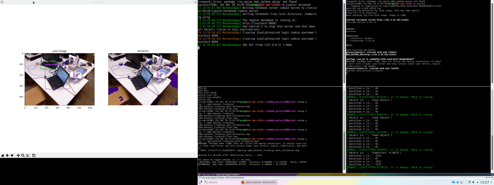
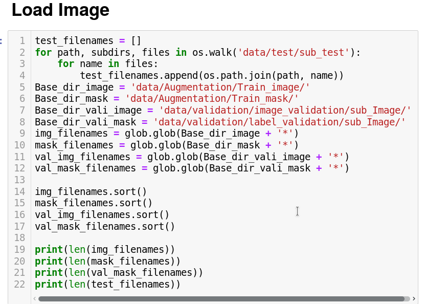
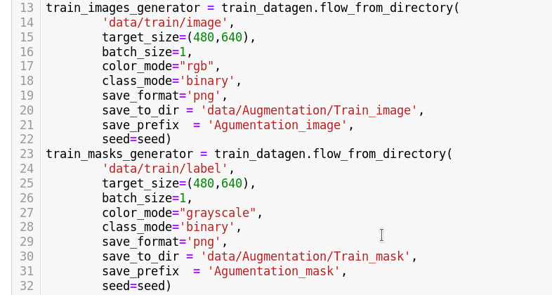
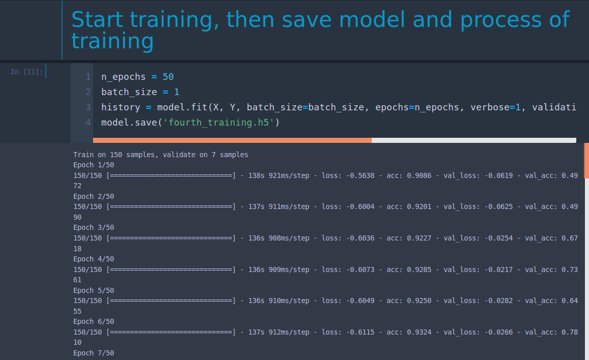

#  Dokumentation for Project SINA Perception #

####  SINA is the ros package for Free Space and Object Detection based on deep Learning. This tutorial will introduce included files and necessary steps for starting the program.

  1.  Create a virtual enviroment with virtualenvwrapper. Please install all dependency pacakges from Requirment.txt is in SINA/src
  ```bash
    pip install -r requirements.txt
  ```  
  2.  Modify ros path in Semantic.py line 3-4 in order to import 3.4.4 opencv instead ros-opencv-3.3.1 dev
  
  3.  Modify file path in Semantic.py line 33-35 so that deep learning weights could be imported. The parameter Object_name is to be changed to the traget object name
  
  4.  Run these commands
  ```bash
    roscore
    cd catkin_ws/
    rosrun SINA Semantic.py
    rosbag play -l rgbd_dataset_freiburg1_desk_validation.bag
  ```

  5.  Here a rosbag recorded by Realsense from TUM is used to test the algorithm, if you want to run the package for your own camera or dataset, please modify the subscriber in Semantic.py line 148
  
  6.  Result
  

#### SINA rospackage contains a whole pipline for training a semantic segmentation netzwork. Relevante files are
  1.  Data Augmentation (automatically).ipynb
  2.  Training for Unet.ipynb
  3.  data

##### A semantic neural network can be trained by Training for Unet.ipynb after doing data augmentation with Data Augmentation (automatically).ipynb. The data for training will be automatically saved in data file. Please check the path before training.

  1.  The first thing you need to do is to modify the path in Training for Unet.ipynb and Data Augmentation (automatically).ipynb. The data augmentation algorithm based on https://keras.io/preprocessing/image/

  
  

  2.  After finishing the setting up, you can start training Unet
  

  3. To Use the trained Unet, the path of weights in main programm Semantic.py need to be modified
  ```python
  unet = unet_class.Unet('/home/xing_usrqj/catkin_ws/src/SINA/src/fourth_training.h5')
  ```
  4. Run the programm
  ```bash
  rosrun SINA Semantic.py
  ```
  5.  The annotation tool for semantic segmentation is “labelme” from MIT.
  https://github.com/wkentaro/labelme
  6. A Demo video could be found under SINA/src/Demo
